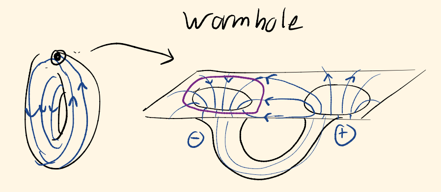

# MATH299G: Geometry in physics

in Fall 2021, at Univeristy of Maryland, I taught a desinged and taught a coruse on geometric methods in physics. It was a seminar-style course which met once a week. I started with an introduction to differential forms inspired by electromagnetism, and went on to classical mechanics discussed in the framework of classical mechanics. Here is a [More detailed syllabus](MATH299G Syllabus.pdf)

See my notes for the class [here](Geometry in physics notes.pdf)

Here are some [Potential final project topics](Final project topics.pdf) relating geometry and physics, accessable with some knowledge of differential forms and their role in physics. 